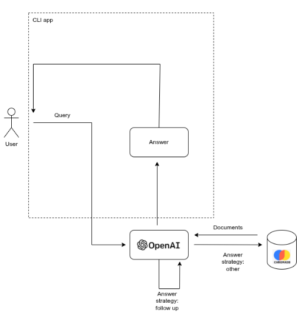

# sales-analytics-rag

Data Warehousing and Business Intelligence course project. Implements a Retrieval-Augmented Generation (RAG) system for analyzing real-world sales data using vector search and LLMs to generate insights into trends and patterns.

# Architecture

The app is fairly simple example of a RAG pipeline. It consists of retrieval planning, potential follow up answering and enricher:

1. At retrieval planning stage, based on the user query, LLM decides which strategy to use (follow up vs no follow up) and which filters to apply for VectorDB search, e.g. meta filters and the number of documents to retrieve.
2. If the strategy is follow up, just use history data and answer based on that.
3. Otherwise, retrieve document(s) from the vector database, and use the documents as a context for the final output.

Roughly this looks like:



The app can provide answer to questions related to the superstore dataset, such as:

1. What is the sales trend over the 4-year period?
2. Which months show the highest sales? Is there seasonality?
3. Which product categories generate the most revenue?
4. What sub-categories have the highest profit margins?
5. Which regions have the best sales performance?
6. Compare Technology vs. Furniture sales
7. How does the West region compare to the East in terms of sales?
8. Any user follow up questions, e.g., "Why does November perform better than ...."

Note: the app is not really production ready, but more like a demoing app for demonstrating how RAG works and how LLMs can be used for simple analytics.

# Setup

### 1. Ready virtual environment

```bash
python3 -m venv .venv
```

### 2. Activate virtual environment

```bash
source .venv/bin/activate
```

### 3. Install dependencies

Either via uv (skip the first command if you already have uv installed):

```bash
pip install uv
```

```bash
uv sync
```

Or with plain pip via requirements.txt:

```bash
pip install -r requirements.txt
```

# Running the app

This assumes that you are running the command from the root folder.

```bash
python3 src/app.py run
```

**Note:** if you are not using uv, drop the `uv run` prefix from the commands below. The tools (`ruff`, `ty`, `deepeval`, `pytest`) are on your PATH once the venv is activated.

# Linting

The app uses Ruff, which you can run by doing:

```bash
uv run ruff check
```

# Type check

To type check the source folder, run this from root:

```bash
uv run ty check --error all ./src
```

# Testing

The app contains a few tests, it's recommended to run them separately:

E.g. LLM evaluation uses LLM-as-a-judge style, with deepevals. Running just the enricher tests works as follows:

```bash
uv run deepeval test run tests/evals/test_eval_rag_enricher.py
```

these can also be explored more deeply at DeepEval website, but requires an API KEY.

Unit tests use pytest, and runs with:

```bash
pytest tests/units
```
